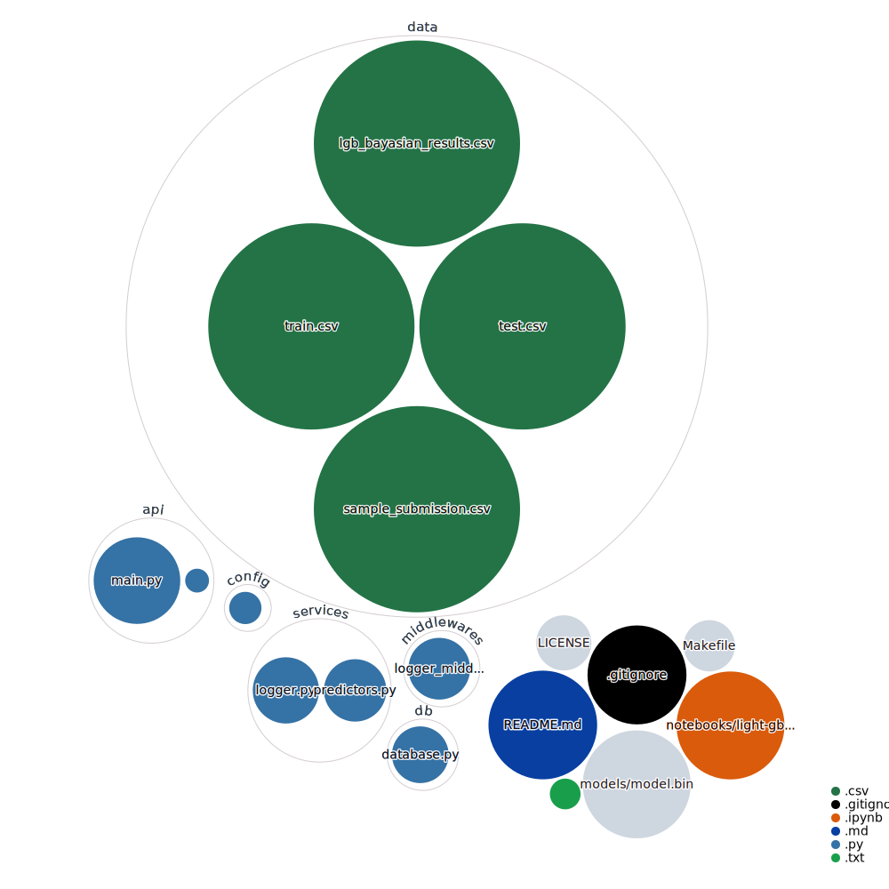

# Store Item Demand Forecasting Challenge

This project is a production-ready **FastAPI** service for predicting sales based on input features (store, item, date, etc.) using a pre-trained **LightGBM** model.
It also includes:
- Health checks
- Batch and single predictions
- Automatic logging of requests/responses to a database using **SQLAlchemy**
- Middleware for API activity tracking
- Structured project layout
- `.env`-based configuration

---

## Project Structure

```bash
US_Foods_Challenge/
├── api/
│   └── main.py            # FastAPI app
├── middlewares/
│   └── logger_middleware.py  # Middleware for logging
├── services/
│   ├── predictors.py     # Feature engineering
│   └── logger.py         # Log to DB
├── db/
│   └── database.py       # SQLAlchemy setup
├── config/
│   └── settings.py       # App settings from .env
├── models/
│   └── model.bin         # Trained LightGBM model
├── schemas.py             # Request/Response Pydantic models
├── requirements.txt      # Python dependencies
├── Makefile              # Project automation
├── .env                  # Environment configuration
└── README.md             # (this file)
```



---

## Setup Instructions

### 1. Clone the Repository

```bash
git clone <your-repo-url>
cd US_Foods
```

### 2. Create Environment and Install Dependencies

Use the `Makefile` provided:

```bash
make install
```

This will:
- Create a `.venv/` virtual environment using `uv`.
- Install all dependencies from `requirements.txt` inside `.venv/`.

### 3. Configure Environment Variables

Create a `.env` file at the project root:

```dotenv
API_TITLE=Sales Prediction API
API_DESCRIPTION=API for predicting sales based on input features like store, item, date, etc.
API_VERSION=1.0.0
MODEL_PATH=./models/model.bin
HOST=0.0.0.0
PORT=8000
DATABASE_URL=sqlite:///./logs.db
```

✅ Adjust paths or ports if necessary.

### 4. Run the API Server

```bash
make run
```

This will launch **Uvicorn** with Hot Reload:

- API URL: [http://0.0.0.0:8000](http://0.0.0.0:8000)
- Docs UI: [http://0.0.0.0:8000/docs](http://0.0.0.0:8000/docs)

---


## Available Makefile Commands

| Command | Description |
|:---|:---|
| `make install` | Set up environment and install all dependencies |
| `make run` | Start the FastAPI server with Hot Reload |
| `make lint` | Run Ruff linter to check code style |
| `make clean` | Remove virtual environment and all build caches |

---

## API Endpoints

### Health

- `GET /` : Health check
- `GET /status` : Status 200 OK for load balancers

### Prediction

- `POST /predict`
  - Accepts either **single** JSON object or **list** of objects.
  - Example input (single):

```json
{
  "date": "2025-05-01",
  "store": 1,
  "item": 40
}
```

- Example input (batch):

```json
[
  {"date": "2025-05-01", "store": 1, "item": 40},
  {"date": "2025-05-02", "store": 1, "item": 41}
]
```

- Response:

```json
{
  "sales": 75
}
```

or for batch:

```json
[
  {"sales": 75},
  {"sales": 80}
]
```

---

## Key Features

- **Model loading** once at startup
- **Async-ready** with lifespan events
- **Logs** every request and response to a database
- **Batch prediction** supported
- **FastAPI native validation** with Pydantic
- **SQLAlchemy** with SQLite backend
- **Automatic database table creation** if missing
- **Monitoring extension**: We could also add threshold monitoring and trigger alerts based on prediction anomalies.

---

## Notes

- Ensure your trained LightGBM model is correctly saved at `./models/model.bin`.
- SQLAlchemy will auto-create `api_logs` table inside `logs.db`.
- You can inspect API logs easily by opening the SQLite file (`logs.db`).

---

## Author

Built by **Ramin**

---

## Future Improvements

- Dockerize the service
- Add authentication for production
- Add more unit and integration tests
- Support model reloading without restart
- Improve database logging scalability (PostgreSQL)
- Add monitoring with alert thresholds for predictions

---

## License

MIT License.

